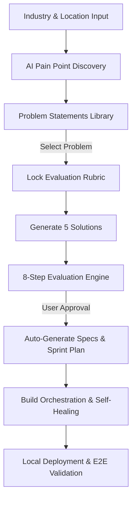
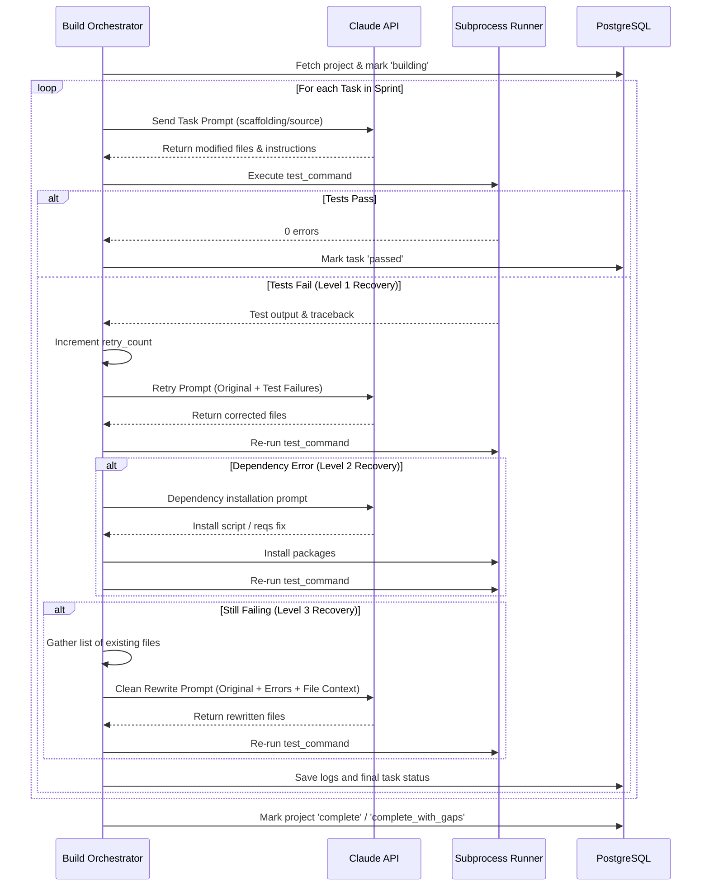
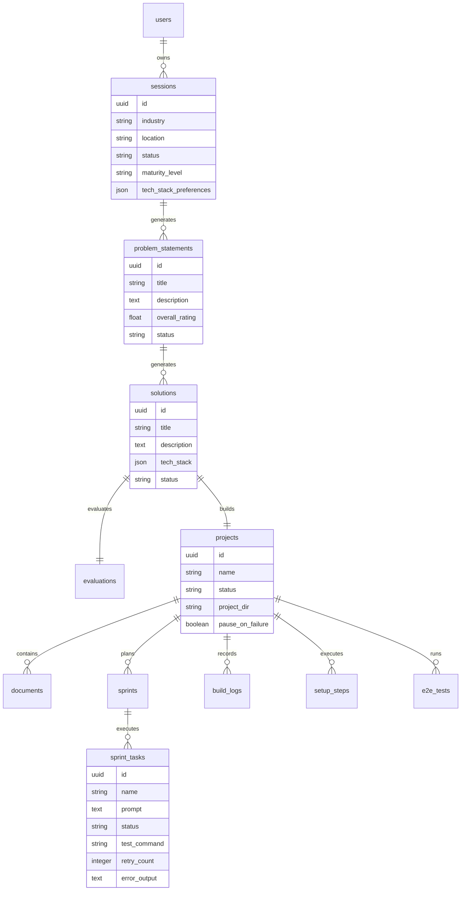

# IdeaForge: System Architecture & Product Walkthrough

Welcome to the comprehensive walkthrough of **IdeaForge**—an AI-powered startup discovery, validation, and auto-build platform. This document outlines the project from both a product (CEO/CPO/CIO) and a technical (CTO/Lead Architect) perspective, preparing you for the upcoming demo.

---

## 💡 Executive Summary (The Elevator Pitch)
IdeaForge changes the paradigm of software development. It bridges the gap between a fuzzy business idea and a running, self-healed, locally testable codebase. Instead of relying on gut feelings, developers, product managers, and founders use IdeaForge to systematically:
1. **Discover** localized industry pain points.
2. **Generate** and rate target-user-focused problem statements.
3. **Draft and lock** objective evaluation rubrics before seeing candidates.
4. **Generate and evaluate** 5 distinct software solution candidates using a strict multi-lens protocol.
5. **Auto-build** the approved solution through an autonomous sprint orchestrator that writes code, runs tests, automatically resolves dependency errors, and self-heals failures using Claude.
6. **Deploy and Run** the generated app in a local sandboxed runner environment.

---

## 🎨 Product & Business Strategy (CPO/CEO Focus)

### The Problem
- **Brainstorming Bias**: Founders fall in love with solutions before understanding the problem.
- **Lack of Rigor**: Ideas are rarely evaluated against objective benchmarks or adversarial perspectives.
- **Execution Gap**: Building a prototype to validate an idea takes weeks and costs thousands of dollars.

### The IdeaForge Solution
IdeaForge implements a **Structured Discovery-to-Code Pipeline**:



### Key Product Features
*   **Maturity Levels**: Tailors the depth of the validation pipeline.
    *   *Proof of Concept (PoC)*: Faster, cheaper, higher temperature (0.9), skipped adversarial steps.
    *   *MVP / Pre-Production / Production*: Successive layers of strictness, lower temperatures, compliance audits, and security rubrics.
*   **Locked Rubric Design**: Prevents AI bias by creating and weighting the evaluation rubric *before* generating solution candidates.
*   **Adversarial Evaluation**: Includes a "Devil's Advocate" attack to stress-test each solution and an ACH (Analysis of Competing Hypotheses) step to find contradictions.
*   **Instant Execution**: Eliminates the "how to build" friction. The user approves a solution, and the system scaffolds the requirements, devises the tasks, writes the source code, runs unit tests, and presents a running app.

---

## 🛠️ System Architecture & Codebase (CTO Focus)

### Tech Stack Overview
| Component | Technology | Role |
| :--- | :--- | :--- |
| **Frontend** | React 18 + TypeScript + Tailwind CSS | Single-page UI, Zustand store state management, Framer Motion transitions. |
| **Backend** | FastAPI + Uvicorn | Async REST API, Pydantic schema validation, JWT auth, rate limiting. |
| **Database** | PostgreSQL + SQLAlchemy | Async engine, JSONB fields for unstructured AI evaluations, schema migrations via Alembic. |
| **Caching & Sync**| Redis | Session management, caching LLM responses, running the build queue. |
| **Core AI Engines** | Anthropic Claude API (Sonnet) & Google Gemini API | Gemini runs Phase 1 (Pain Points/Problems); Claude orchestrates Phase 2 (Code Generation/Fixes). |

### Component Architecture

```
                                  +-------------------+
                                  |    React UI       |
                                  |   (Zustand / TS)  |
                                  +---------+---------+
                                            |  HTTP REST
                                            v
                                  +-------------------+
                                  |   FastAPI Server  |
                                  +----+-----+-----+--+
                                       |     |     |
                 +---------------------+     |     +--------------------+
                 | Async DB Queries          | LLM Prompt Chaining      | Local Exec
                 v                           v                          v
      +--------------------+       +-------------------+      +-------------------+
      |   PostgreSQL DB    |       | Gemini / Claude   |      |  Project Runner   |
      |                    |       | (Structured JSON) |      | (Process Manager) |
      +--------------------+       +-------------------+      +-------------------+
```

---

## ⚡ The Code Generation & Self-Healing Loop

The heart of Phase 2 is the **Build Orchestrator** ([build_orchestrator.py](file:///home/dev84/Work/aiAutomation/backend/app/services/build_orchestrator.py)), which executes a series of chronological sprint tasks. Each task represents a prompt to be run against a Claude session.



### Multi-Level Self-Healing Details
1.  **Level 1: Direct Retry with Context**: Sends the failing test stdout/stderr traceback back to Claude, instructing it to fix the file without modifying the test file.
2.  **Level 2: Dependency / Import Repair**: If the traceback contains `ModuleNotFoundError` or `npm ERR!`, the system runs a dependency installation prompt to write to `requirements.txt` or `package.json` and runs `pip install`/`npm install` in the background.
3.  **Level 3: Clean Rewrite**: If Level 1 & 2 fail, the system crawls the project directory, lists all relevant files on disk, and sends a comprehensive rewrite prompt containing the full directory context to prevent Claude from hallucinating missing modules.

---

## 🗄️ Database Entity Schema

The database relies on PostgreSQL. Below is the relationship mapping from the user's ideation session to the compiled source code.



---

## 🎤 Demo Cheat Sheet (Q&A Preparation)

Here are the questions your leadership is most likely to ask during the demo, along with direct, authoritative answers.

### 👥 CEO / CPO Questions (Product & UX)
> **Q: How does this prevent "garbage in, garbage out" when users input a bad industry or location?**
> *   **A:** The validation pipeline includes a predefined registry of common industries and structured autocomplete features. Furthermore, the pain point discovery service is grounded in geographical context (looking at regional regulations, local market maturity, and existing infrastructure). Bad ideas fail early during the **Disqualifier Gates** step, where solutions are evaluated against core business blockers before we waste time scoring or attacking them.

> **Q: Why do we have to create the rubric before we see the solutions?**
> *   **A:** To eliminate cognitive bias. If the AI generates solution candidates first and then writes the evaluation rubric, it naturally tailors the rubric criteria to favor the candidates it just created. By forcing the system to generate and lock the rubric *first*, we ensure the solutions are evaluated against strict, objective, and unbiased parameters.

---

### 💻 CTO Questions (Engineering & Architecture)
> **Q: The build orchestrator runs subprocesses and executes code generated by the LLM. How do we secure the environment?**
> *   **A:** The project is designed to run in isolated local environments using custom directory sandboxing. In production, this runner can be housed inside stateless Docker containers (configured via our `Dockerfile` setup) with restricted network and disk permissions, ensuring that generated code cannot access the host machine's environment variables or root filesystem.

> **Q: LLMs frequently break JSON formatting or hit token limits. How do we handle malformed LLM responses?**
> *   **A:** All LLM endpoints utilize Pydantic validation schemas. If an LLM response does not match the schema, the system catches the validation error, appends it to a re-prompt, and triggers a single auto-retry. We also enforce lower temperatures (e.g. 0.3) for evaluation calls to guarantee deterministic structured layouts and restrict `max_tokens` to manage LLM API budgets.

> **Q: How does the system handle rate limits or API quotas during code generation?**
> *   **A:** The `BuildOrchestrator` parses rate limit errors (looking for reset durations in the LLM response). If a rate limit is hit, the task status is marked `rate_limited`, the project is paused, and the orchestrator schedules an automatic resume job using the `CronService` to wake the build back up once the rate limit window closes.

---

## 🚀 Step-by-Step Demo Sequence

When showing off the live app, follow this script to show the full end-to-end magic:

1.  **Login/Register**: Log in to show the JWT secure authentication flow.
2.  **Session Creation**: Create a new session with "Fintech" in "India". Choose **MVP** maturity level and select preferred technologies (e.g. *React, FastAPI, PostgreSQL*).
3.  **Discovery**: Click "Discover" to kick off the Gemini pain point pipeline. Highlight the color-coded severity badges and stakeholder tags.
4.  **Problem Selection**: Choose a problem statement (e.g. "Inefficient credit scoring for rural micro-merchants") and click "Generate Solutions".
5.  **Evaluation Wizard**: Walk through the steps. Emphasize:
    *   The **Rubric Editor** (locked first!).
    *   The **Disqualifier Gate** (showing which solutions passed or failed).
    *   The **Devil's Advocate Attacks** and **ACH analysis**.
    *   The **Comparison Matrix** showing weighted scores side-by-side.
6.  **Approval & Build**: Select the best solution, click "Approve", which creates the project and triggers document generation (PRD/TRD).
7.  **Sprint Build Panel**: Switch to the project build dashboard. Show the sprints and tasks. Click **Start Build**. Watch the build logs stream in real-time as the system runs Claude, executes pytest, and handles self-healing.
8.  **Project Runner**: Show that you can launch the generated app using the runner panel and view the live container status.

---

*Good luck with the demo! You have an extremely powerful project on your hands.*
